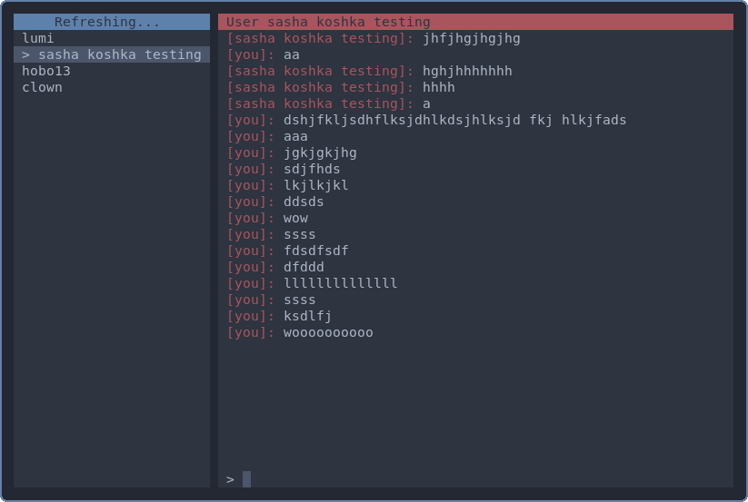

# imhey

SpaceHey has a very wierd "instant messanger" built into it. I got really
curious and decided to figure out how it worked. Long story short I reverse
engineered the api a bit, and made this alternative client in NodeJS using
the neo-blessed interface library.

Please be aware that this is experimental, and there are bugs. Mainly because I
almost exclusively work on this half asleep.

## Setup

In order for it to work, you need to find your session ID using these steps:

1. Log into spacehey
2. Open up the F12 menu
3. Go to the network tab
4. Reload the page
5. Click on any request in the list
6. Scroll down to where it says request headers, and you should see a header
   called "Cookie"
7. Find your session ID. It is the string of random numbers and letters after
   "PHPSESSID=".
8. Copy the session ID. Make sure to only copy the numbers and letters starting
   after the = sign and ending before the semicolon.

Then, navigate to the directory of this repo and run `node index.js`, and it
should ask for your key. Once you enter it, you should be able to use the
program.

I may experiment with username/password login in the future

## Usage

On the left, you can see all of you conversations. On the right, you can see the
conversation history of the currently selected conversation.

### Keybinds

- `enter`: Send message
- `up`: Switch to chat above
- `down`: Switch to chat below
- `ctrl-r`: Force refresh
- `ctrl-d`: Exit

## Current Features

- Switch between chats
- Send and recieve messages
- Animated cooldown timer (SpaceHey site doesn't even have this ;))
- Force refresh
- Can have quicker loading times than the official version (also causes slightly
  less server load!)
- Will run anywhere theres node and a terminal - you don't even need a graphical
  desktop installed to use it

## Planned Features

- Less bugs of course
- Block and report buttons
- Proper html special chars parsing
- Multiline text editing
- Url image embeds (on terminals such as kitty)
- Caching message history to disk
- Adding new chats from friends list
- View basic user profile info
